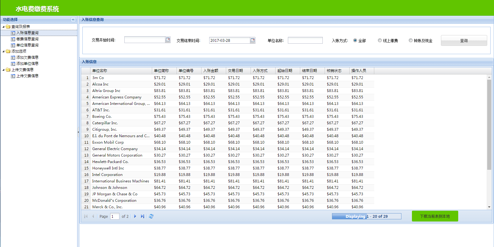

:bouquet: TempBasedExtJS
==========

> 支持IE8.0，基于ExtJS 4.2.0 搭建的前端项目框架。

> 这个仓库是我针对IE8 学习ExtJS 4.2.0 后搭建的前端项目框架。这本是一个银行项目，可惜中途夭折，因缺少需求，所以目前只有框架:blush:。

效果截图
------------


项目目录说明
-------

```
.

|-- app                                 // 源码目录
|   |-- controller                      // 控制器
|       |-- Manager.js                  // 控制路由切换，页面初始化
|   |-- data                            // 模拟数据
|       |-- company.json                
|   |-- model                           // 模型
|       |-- Company.js                  
|   |-- store                           // store
|      
|   |-- view                            // 视图组件
|       |-- add                         // add 模块
|            |-- AddOwn.js              // 页面组件
|            |-- AddUnit.js             // 页面组件
|       |-- check                       // check 模块
|            |-- CheckIn.js             // 页面组件
|            |-- CheckPay.js            // 页面组件
|            |-- CheckUnit.js           // 页面组件
|            |-- ProgressBarPager.js    // 页面组件
|       |-- upload                      // upload 模块
|            |-- UploadOwn.js           // 页面组件
|       |-- AppHeader.js                // 加载各种store模块
|       |-- ContentPanel.js             // 内容组件
|       |-- Navigation.js               // 目录树
|       |-- ProgressBarPager.js         // 进度条组件
|       |-- Viewport.js                 // viewport
|-- extjs                               // extjs源码
|-- resources                           // 存放静态文件
|   |-- css                             // 存放静态文件css
|   |-- imgs                            // 存放静态文件img
|-- app.js                              // 代码入口文件
|-- README.md                           // 项目说明
|-- index.html                          // 主页面
|-- package.json                        // 用于项目运行
.
```